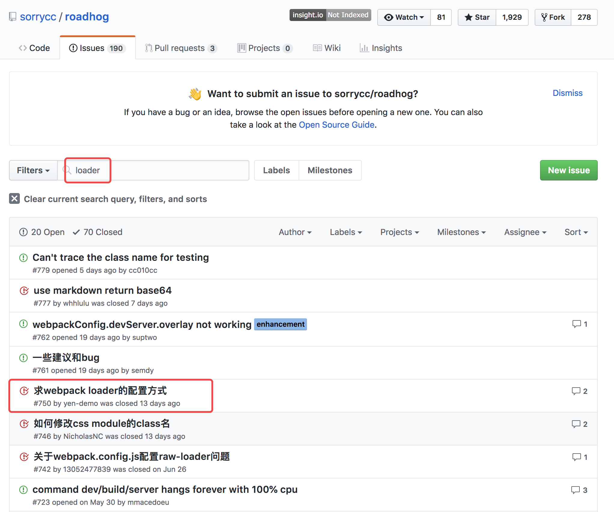

## 一、admin 项目配置 meepojs-loader

1.   接入 meepojs？ 项目里面公用的发请求的模块，需新引入[meepojs](https://git.hahaha.com/xxxxx/digital-purchase/meepojs)和[meepojs-loader](https://git.hahaha.com/xxxxx/digital-purchase/meepojs-loader)。(loader 用于对源代码转换，loader 可以再你 import 或者加载模块时候预处理文件，推荐在 webpack.config.js 中指定 loader)
2.  admin 项目使用的 ant-design-pro 框架底层使用构建打包工是[roadhog](https://github.com/sorrycc/roadhog/blob/master/README_zh-cn.md)，roadhog 可以理解为被阉割的[webpack](https://webpack.docschina.org/concepts/)，查找 npm 和 git，roadhog 未暴露 loader 接口？ 查找 issues 发现 webpack.config.js 配置 loader 即可。
    
        ```javascript
        module.exports = (webpackConfig, env) => {
        webpackConfig.module.rules.push({
            test: /\.yml$/,
            loader: 'meepojs-loader'
        })
        return webpackConfig
        }
        ```
3.  我们发现配置了之后，yml 文件的输出依旧被处理成 base64 的格式？
    ```javascript
    import orderApiConf from './order.yml';
    console.log('orderApiConf', orderApiConf);
    // orderApiConf data:text/yaml;base64,ZXhwb3J0I....
    // 打印下webpackConfig看下添加的meepojs-loader是否生效
    var exp1 = { a: /a/, b: 1 };
    JSON.stringify(exp1);
    // {"a":{},"b":1}
    // 尴尬了，我们需要看到value里面的正则，JSON.stringify()打印不出正则的表达式，现在需要找一个能打印出正则库，才能进一步定位问题
    ```
4.  引入 stringify-object，打印出 console.log(stringifyObject(webpackConfig.module))，查看配置项，分析可能出现问题。
    ```javascript
    发现url-loader的配置如下，猜想.yml文件小于10KB时候采用url-loader，将xxx.yml根据内容计算出base64编码的字符串直接注入代码中。我们期望的xxx.yml是一个object对象，写的是请求的配置。显然base64内容并不符合我们的期望。所以目前的问题在于如何将xxx.yml中的内容用loader转换成正常配置的object。
    {
        exclude: [
            /\.(html|ejs)$/,
            /\.json$/,
            /\.(js|jsx|ts|tsx)$/,
            /\.(css|less|scss|sass)$/
        ],
        loader: '/Users/weiqian/Desktop/Windrunner/node_modules/url-loader/index.js',
        options: {
            limit: 10000,
            name: 'static/[name].[hash:8].[ext]'
        }
    }
    ```
5.  防止 xxx.yml 被 url-loader 转换，我们加上代码，当发现 xxx.yml 时候不再用 url-loader 进行转换。

    ```javascript
    module.exports = (webpackConfig, env) => {
      webpackConfig.module.rules.push({
        test: /\.yml$/,
        loader: 'meepojs-loader',
      });
      for (let i = 0; i < webpackConfig.module.rules.length; i++) {
        const rule = webpackConfig.module.rules[i];
        if (rule.loader && rule.loader.indexOf('url-loader') > -1) {
          webpackConfig.module.rules[i].exclude.push(/\.yml$/);
        }
      }
      return webpackConfig;
    };
    ```

6.  好了终于成功的配置了 loader，可以愉快的读取到 yml 文件的配置。
