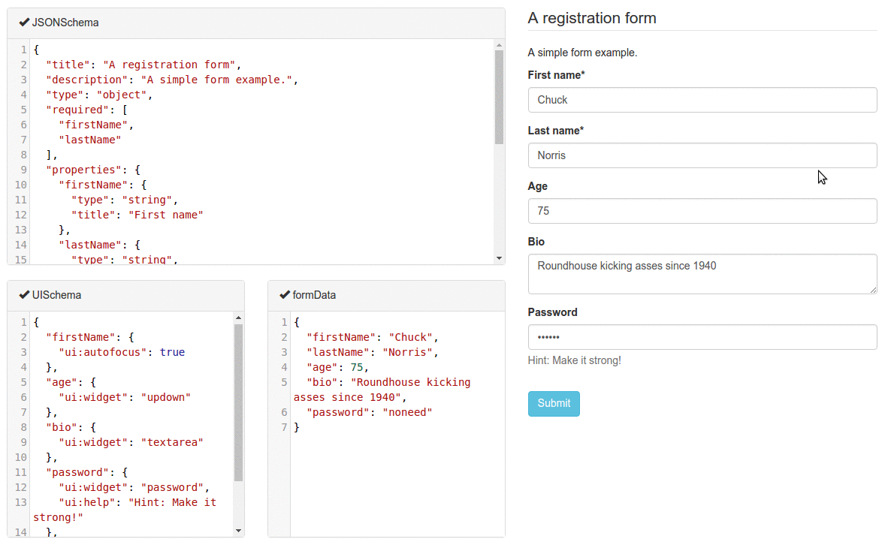

### Outline

What is form

How would you make a form

Why formily

Demo

### What is form

##### form = validator + ui 

场景归纳：组件数据收集&校验&更新的流程是一致。

流程抽象：通过配置屏蔽组件间的差异性，对组件的配置规则统一管理。

常见form方案 youform (jsx 语法方式来声明表单 form + formItem) 

mozilla  jsonSchemaForm(通过 json 描述来构建表单，支持了配置化方式来构建表单)

 https://github.com/rjsf-team/react-jsonschema-form

Antd Form 

 https://github.com/ant-design/ant-design/tree/master/components/form (antform)

https://github.com/react-component/form （rc-form 在antdV3.0及以下使用，antdV4用rc-field-form）

redux-form作者finalform: https://github.com/final-form/final-form

Razzle作者、react领域目前star(21k )最多的form formik https://github.com/jaredpalmer/formik

阿里内部的其他方案，例如alibaba/nopage(noform)作者鬼鼠也加入 ，集中做formily集团表单方案，外部核心成员于秋水（飞冰pm）

阿里集团共建的表单领域型解决方案Formily

@**uform/core**

- 时间旅行能力支持，整体Form Tree State可观察，可回溯
- 内置immer，精确更新，智能降级，无需关心浏览器版本
- 更加完备的校验引擎
- 悲观校验(validateFirst)能力
- warning校验
- 手动批量或精确校验字段能力
- 手动清除校验消息能力
- 更加校验规则扩展机制
- 增加正则规则扩展机制
- 增加校验消息模板引擎定制能力
- 更加完备的生命周期钩子
- 更加完备的路径解析引擎
- 解耦schema，更易扩展/二次开发(过去0.x的core是强耦合json schema的)

@**uform/react**

- 包名变更，它只负责react组件的状态管理，无关json schema，若用户对UI定制需求高，则可直接使用该库进行开发
- 同样的actions/effects，但带来的是更大的想象空间

@**uform/react-schema-renderer**

- 包含了过去0.x的@uform/react几乎100%的能力，只有少部分API有变化
- 升级表单协议，提供了更完备的json schema解析校验能力
- 更高效方便的Form/FormItem样式定制能力
- 提供了更加灵活的自定义组件开发方式，用来适配更复杂的业务场景

@**uform/antd or @uform/next**

- 废除过去私有FormItem样式，全部继承组件库样式，所以不会再存在18px的空白占位符问题，同时也能支持对应组件库的主题样式定制能力
- 废除array组件的默认样式，统一采用cards样式，更加标准化，也能很好的适配组件库主题样式定制能力
- array table内部的table组件采用了对应组件库的table，可以适配更加复杂的table定制需求
- 支持了FormStep布局组件，可以非常方便的处理分步表单场景

##### 或许formliy可以和这些有关系

