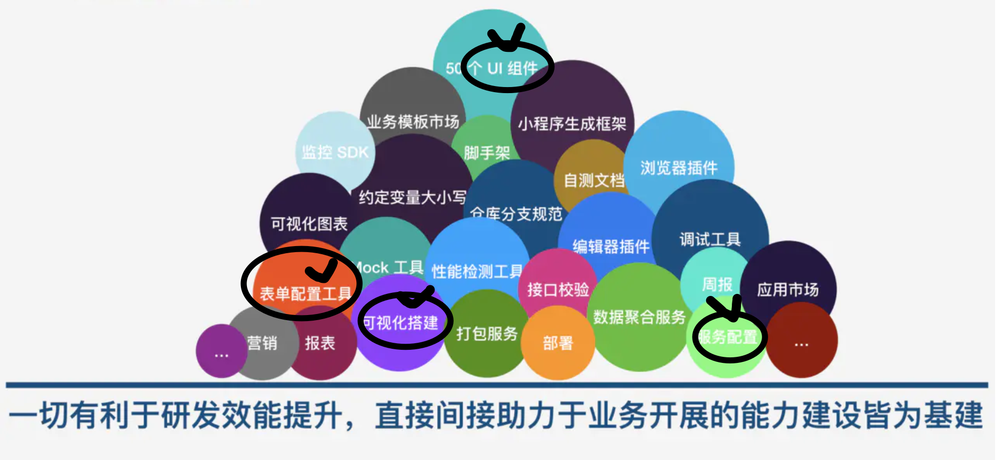

### Outline

What is form

How would you make a form

Why formily

Demo

### What is form

##### your form = validator + ui 

表单场景归纳：组件的数据收集、校验、数据更新的流程是一致的。

流程抽象：通过配置屏蔽组件间的差异性，对组件的配置规则统一管理。

即为常见的 Form 表单的解决方案

- 如何实时收集内部组件的数据？
- 如何对组件的数据进行校验？
- 如何更新组件的数据？

#### Ant Form = ui + rc-form (https://zoo.team/article/antd-form)

Form.create({})(CustomizedForm)。

##### 初始化阶段

Form.create 函数指向 rc-form 提供的 createBaseForm 方法，createBaseForm 则创建了高阶组件 decorate。

decorate 的参数就是我们的 CustomizedForm 自定义组件。decorate 会创建一个被 BaseForm 组件包裹的自定义表单组件，经过包裹的组件将会自带 `this.props.form` 属性。为了方便记忆，我们把这个组件称为 FormHocCustomizedForm。

组件创建完成之后，FormHocCustomizedForm 就会经历 React 组件的生命周期。

##### getInitailState 阶段

Form 并没有通过内部的 state 来管理内部组件的值， 而且创建了 FieldsStore 实例，也就是上面提到的组件数据管理中心。

##### Render 阶段

被 Form 管理的组件，需要使用 props.form.getFieldDecorator 来包装，在 Render 阶段需要调用 getFieldDecorator 传入我们的组件配置，包括字段名 name 以及组件元数据 otherOptions，再将字段对应的组件传入 getFieldDecorator 返回的高阶组件。

Form 通过 `getFieldDecorator` 对组件进行包装，接管组件的 value 和 `onChange` 属性，当用户输入改变时，触发 onCollect 或 onCollectValidate 来收集组件最新的值

##### 嵌套数据结构收集

##### 自定义表单接入

##### 表单联动

组件的数据由 FieldStore 来统一管理，组件值变化时也会实时更新，所以结合 ES6 的 get 方法可以很简单的实现组件之间的联动。

formily = JSON Schema(JSchema)** + **字段分布式管理** + **React EVA**

##### 或许formliy可以和这些有关系

