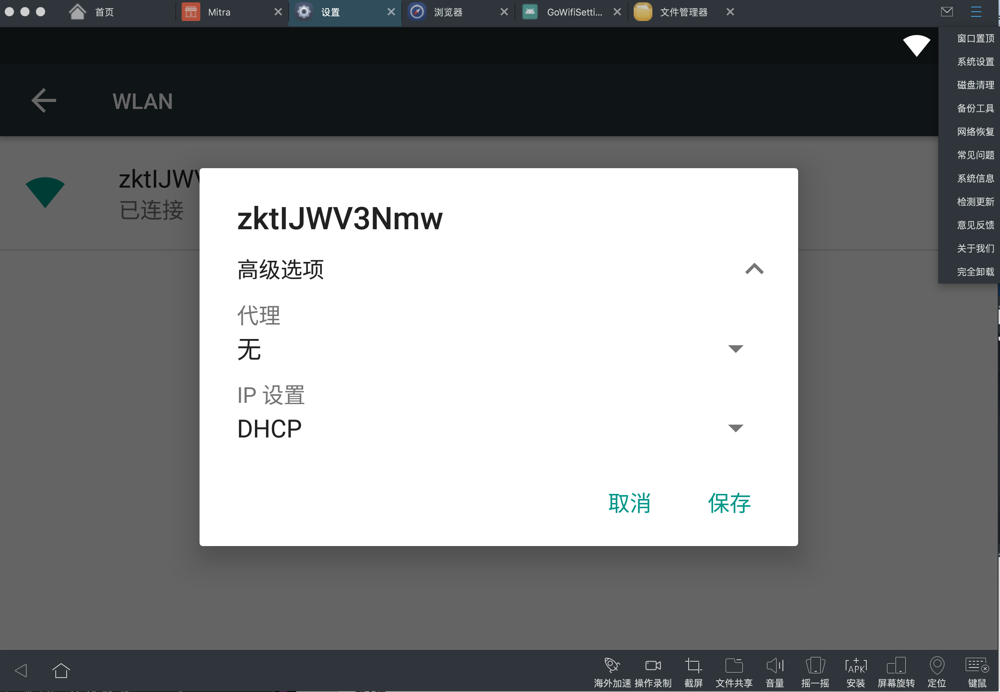
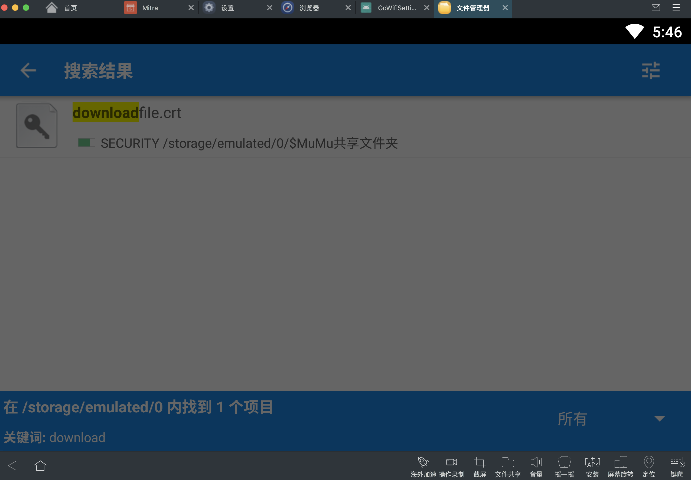

### 一、手机模拟器

visual studio =andorid studio 

https://developer.android.com/studio

https://www.cnblogs.com/Owen-ET/p/10271090.html

chls.pro/sslcc

xcode 

其他模拟器： mumu

### 二、xcode 

打开模拟器指令

kill $(lsof -t -i:8081)

xcrun instruments -s

xcrun instruments -w "iPhone 11 (13.5)"

 xcrun simctl io booted recordVideo filename.mov

### 三、mumu

优点： 安装快速使用简单

缺点： 不能抓包，也无法安装证书，输入法经常失灵，支持功能少

建议：不建议开发用，除非你只是看下app的运行，什么都不做

